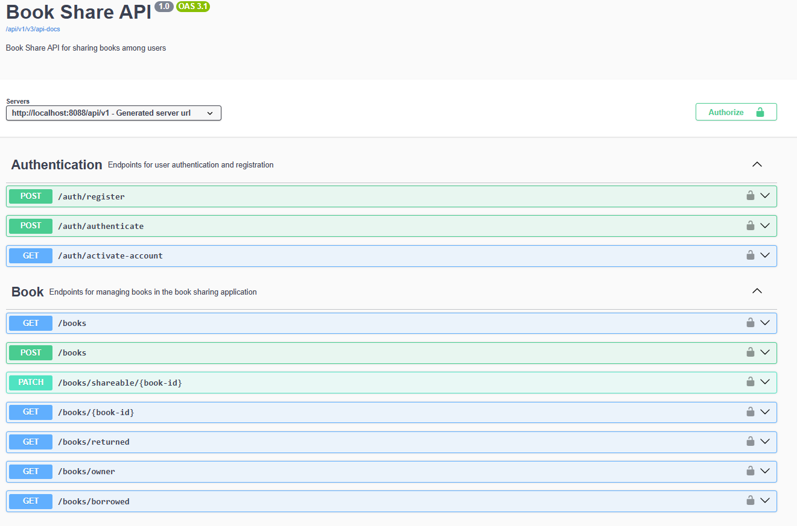

# 📚 Book Share API

**Book Share API** is a modern, scalable **RESTful API** platform that allows users to manage, share, and lend books. Built with **Spring Boot 3**, the project follows industry best practices regarding security, database auditing, and interactive documentation.

## 🚀 Key Features

* **Secure Authentication:** Implements **Spring Security** with **JWT (JSON Web Token)** for stateless, token-based authentication.
* **JPA Auditing:** Automatically tracks record metadata (who created/modified a record and when) using `@CreatedBy`, `@LastModifiedDate`, and a custom `AuditorAware` implementation.
* **Rich Domain Model:** Fully mapped relational database involving Users, Books, Transaction Histories, and Feedbacks.
* **Interactive API Docs:** Integrated with **Swagger (OpenAPI)** for real-time testing of all endpoints.
* **Context-Path Management:** All API routes are prefixed with `/api/v1/` for versioning and organization.
* **Async Support:** Utilizes `@EnableAsync` for non-blocking operations like sending emails.

---

## 🛠️ Tech Stack

| Layer | Technology |
| :--- | :--- |
| **Framework** | Spring Boot 3.5.11 |
| **Language** | Java 17 |
| **Database** | PostgreSQL |
| **Security** | Spring Security 6, JJWT |
| **Documentation** | SpringDoc OpenAPI (Swagger UI v2.8.5) |
| **Libraries** | Lombok, Maven, Dotenv, Hibernate (JPA) |

---

## 🏗️ Architecture & Database Schema

The system is built around four core entities:

1.  **User:** Implements `UserDetails` and `Principal`. Handles role-based access control (e.g., `USER`, `ADMIN`).
2.  **Book:** Stores book metadata. Linked to a **User** (Owner) via a **Many-to-One** relationship.
3.  **BookTransactionHistory:** Manages the lifecycle of book loans, including return status and approvals.
4.  **FeedBack:** Stores ratings and comments for books.

---

## ⚙️ Setup and Installation

### 1. Prerequisites
* **JDK 17** or higher
* **Maven 3.x**
* **PostgreSQL** (Local or via Docker)

### 2. Environment Variables (.env)
Create a `.env` file in the root directory and configure the following variables:
*(Add your environment variables explanation here)*

---

## 📖 API Documentation (Swagger)

Once the application is running, you can access the interactive Swagger UI to explore and test the endpoints:

🔗 **Swagger UI:** http://localhost:8088/api/v1/swagger-ui/index.html

### 📌 Endpoints Overview
Here is a quick look at the available endpoints in the Book Share API:

